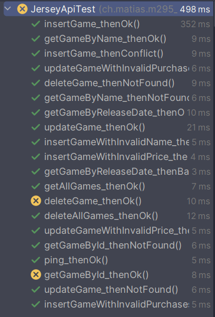

# Steam from wish

## Beschreibung
"Steam from wish" ist eine RESTful-API für die Verwaltung einer Sammlung von Spielen und den dazugehörigen Herausgebern. 
Er bietet Endpoints für das Erstellen, Aktualisieren, Abrufen und Löschen von Spielen sowie für die Suche nach Spielen 
anhand verschiedener Attribute wie Name und Release Date.

## Visuals
### Datenbankdiagramm

### Klassendiagramm

### Screenshot der Testdurchführung

## Validierungsregeln
- Name des Spiels ("name", String): Nicht mehr als 45 Zeichen lang.
- Preis des Spiels ("price", BigDecimal): Nicht mehr als CHF 300.
- Anzahl Käufe des Spiels ("purchases", Integer): Muss 0 oder Positiv sein.

Assumptions for game:

- A game name has to be unique

Remark about test:

- Doesn't work with id because of auto-increment
- 

## Bemerkungen
Bei einem Fehler `Preview not enabled`, muss der TomCat Server muss mit der folgenden VM-Option gestartet werden: `--enable-preview`