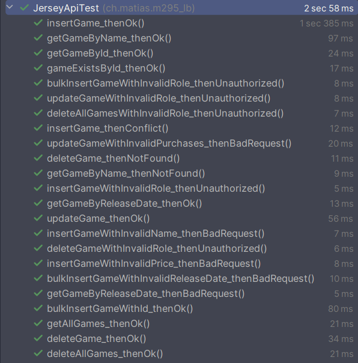
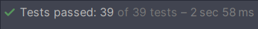

# Steam from wish

## Beschreibung
`Steam from wish` ist eine *RESTful-API* für die Verwaltung einer Sammlung von Spielen und den dazugehörigen Herausgebern. 
Er bietet Endpoints für das **Erstellen**, **Aktualisieren**, **Abrufen** und **Löschen** von *Spielen* sowie für die **Suche** nach Spielen 
anhand **verschiedener Attribute** wie Name und Release Date.

## Visuals
### Datenbankdiagramm


### Klassendiagramm


### Screenshot der Testdurchführung




*Bemerkung über Tests unter [Bemerkungen](#Bemerkungen)*

## Validierungsregeln
- Name des Spiels (`name`, *String*): Nicht mehr als 45 Zeichen lang.
- Preis des Spiels (`price`, *BigDecimal*): Nicht mehr als CHF 300.
- Anzahl Käufe des Spiels (`purchases`, *Integer*): Muss 0 oder Positiv sein.

## Berechtigungsmatrix
| Endpoint                      | Rolle          | Access Type | HTTP-Methoden |
|-------------------------------|----------------|-------------|---------------|
| `/games/ping`                 | Alle           | Lesen       | GET           |
| `/games`                      | Alle           | Lesen       | GET           |
| `/games/count`                | Alle           | Lesen       | GET           |
| `/games/exists/{id}`          | Alle           | Lesen       | GET           |
| `/games/byId/{id}`            | Alle           | Lesen       | GET           |
| `/games/byName/{name}`        | Alle           | Lesen       | GET           |
| `/games/byReleaseDate/{date}` | Alle           | Lesen       | GET           |
| `/games`                      | ADMIN          | Schreiben   | POST          |
| `/games/bulk`                 | ADMIN          | Schreiben   | POST          |
| `/games`                      | ADMIN          | Update      | PUT           |
| `/games/{id}`                 | ADMIN, CLEANER | Löschen     | DELETE        |
| `/games`                      | ADMIN, CLEANER | Löschen     | DELETE        |
| `/database/create`            | ADMIN          | Schreiben   | POST          |

## Bemerkungen
- Es wird angenommen, dass ein Spielname eindeutig ist.
- Bei einem Fehler `Preview not enabled`, muss der *TomCat Server* mit der folgenden *VM-Option* gestartet werden: `--enable-preview`
- Bei den Tests funktionieren Tests mit `id` nicht, da die `id` auf `auto_increment` gesetzt ist.

Damit die Tests zu 100% funktionieren, kann man den Folgenden Skript in MySQL laufen lassen:
```mysql
DELETE FROM steam.game;
DELETE FROM steam.publisher;
ALTER table steam.game AUTO_INCREMENT = 1;
```

## OpenAPI Dokumentation der Services (Ressourcen)
```yaml
openapi: "3.0.0"
info:
  version: "1"
  title: "Steam from wish"
  description: "Spielverwaltung"
paths:
  /database/create:
    post:
      operationId: "createTables"
      description: ""
      parameters: []
      requestBody:
        content:
          application/json:
            schema:
              type: "string"
      responses:
        200:
          description: ""
          content:
            application/json:
              schema:
                type: "string"
        500:
          description: ""
          content:
            application/json:
              schema:
                type: "string"
  /games/ping:
    get:
      operationId: "pingGames"
      description: ""
      parameters: []
      responses:
        200:
          description: ""
          content:
            text/plain:
              schema:
                type: "string"
  /games:
    get:
      operationId: "getAllGames"
      description: ""
      parameters: []
      responses:
        200:
          description: ""
          content:
            application/json:
              schema:
                type: "array"
                items:
                  $ref: "#/components/schemas/game"
        204:
          description: ""
          content:
            application/json:
              schema:
                type: "string"
    post:
      operationId: "insertGame"
      description: ""
      parameters: []
      requestBody:
        content:
          application/json:
            schema:
              $ref: "#/components/schemas/game"
      responses:
        200:
          description: ""
          content:
            application/json:
              schema:
                $ref: "#/components/schemas/game"
        400:
          description: ""
          content:
            application/json:
              schema:
                type: "string"
        409:
          description: ""
          content:
            application/json:
              schema:
                $ref: "#/components/schemas/game"
        500:
          description: ""
          content:
            application/json:
              schema:
                type: "string"
    put:
      operationId: "updateGame"
      description: ""
      parameters: []
      requestBody:
        content:
          application/json:
            schema:
              $ref: "#/components/schemas/game"
      responses:
        200:
          description: ""
          content:
            application/json:
              schema:
                $ref: "#/components/schemas/game"
        400:
          description: ""
          content:
            application/json:
              schema:
                type: "string"
        404:
          description: ""
          content:
            application/json:
              schema:
                type: "string"
        500:
          description: ""
          content:
            application/json:
              schema:
                type: "string"
    delete:
      operationId: "deleteAllGames"
      description: ""
      parameters: []
      requestBody:
        content:
          application/json:
            schema:
              type: "string"
      responses:
        200:
          description: ""
          content:
            text/plain:
              schema:
                type: "string"
        500:
          description: ""
          content:
            text/plain:
              schema:
                type: "string"
  /games/count:
    get:
      operationId: "getGameCount"
      description: ""
      parameters: []
      responses:
        200:
          description: ""
          content:
            application/json:
              schema:
                type: "integer"
  /games/byName/{name}:
    get:
      operationId: "getGameByName"
      description: ""
      parameters:
        - in: "path"
          name: "name"
          required: true
          schema:
            type: "string"
      responses:
        200:
          description: ""
          content:
            application/json:
              schema:
                $ref: "#/components/schemas/game"
        400:
          description: ""
          content:
            application/json:
              schema:
                type: "string"
        404:
          description: ""
          content:
            application/json:
              schema:
                type: "string"
        500:
          description: ""
          content:
            application/json:
              schema:
                type: "string"
  /games/byId/{id}:
    get:
      operationId: "getGameById"
      description: ""
      parameters:
        - in: "path"
          name: "id"
          required: true
          schema:
            type: "integer"
      responses:
        200:
          description: ""
          content:
            application/json:
              schema:
                $ref: "#/components/schemas/game"
        404:
          description: ""
          content:
            application/json:
              schema:
                type: "string"
  /games/exists/{id}:
    get:
      operationId: "gameExistsById"
      description: ""
      parameters:
        - in: "path"
          name: "id"
          required: true
          schema:
            type: "integer"
      responses:
        200:
          description: ""
          content:
            text/plain:
              schema:
                type: "boolean"
        404:
          description: ""
          content:
            text/plain:
              schema:
                type: "boolean"
  /games/byReleaseDate/{releaseDate}:
    get:
      operationId: "getGamesByReleaseDate"
      description: ""
      parameters:
        - in: "path"
          name: "releaseDate"
          required: true
          schema:
            type: "string"
      responses:
        200:
          description: ""
          content:
            application/json:
              schema:
                type: "array"
                items:
                  $ref: "#/components/schemas/game"
        400:
          description: ""
          content:
            application/json:
              schema:
                type: "string"
        404:
          description: ""
          content:
            application/json:
              schema:
                type: "string"
        500:
          description: ""
          content:
            application/json:
              schema:
                type: "string"
  /games/bulk:
    post:
      operationId: "insertGames"
      description: ""
      parameters: []
      requestBody:
        content:
          application/json:
            schema:
              type: "array"
              items:
                $ref: "#/components/schemas/game"
      responses:
        200:
          description: ""
          content:
            application/json:
              schema:
                type: "array"
                items:
                  $ref: "#/components/schemas/game"
        400:
          description: ""
          content:
            application/json:
              schema:
                type: "string"
        500:
          description: ""
          content:
            application/json:
              schema:
                type: "string"
  /games/{id}:
    delete:
      operationId: "deleteGameById"
      description: ""
      parameters:
        - in: "path"
          name: "id"
          required: true
          schema:
            type: "integer"
      requestBody:
        content:
          application/json:
            schema:
              type: "string"
      responses:
        200:
          description: ""
          content:
            application/json:
              schema:
                type: "string"
        404:
          description: ""
          content:
            application/json:
              schema:
                type: "string"
        500:
          description: ""
          content:
            application/json:
              schema:
                type: "string"
components:
  securitySchemes: {}
  schemas:
    publisher:
      properties:
        id:
          nullable: false
          type: "integer"
        name:
          nullable: false
          type: "string"
        games:
          nullable: false
          type: "array"
          items:
            $ref: "#/components/schemas/game"
    game:
      properties:
        id:
          nullable: false
          type: "integer"
        name:
          nullable: false
          type: "string"
        releaseDate:
          nullable: false
          type: "string"
        price:
          nullable: false
          type: "number"
        purchases:
          nullable: false
          type: "integer"
        released:
          nullable: false
          type: "boolean"
        publisher:
          nullable: false
          $ref: "#/components/schemas/publisher"
```

## Autor
[Matias Varela Cousillas](https://github.com/varelam-bzz)

## Zusammenfassung
Es wurden alle Endpoints implementiert sowie auch getestet. Die Dokumentation enthält Anhänge über das ERD, das 
UML-Klassendiagramm sowie auch die Testresultate. Zudem enthält sie auch noch eine OpenAPI YAML Dokumentation des 
Services. Das Projekt war spannend und cool 😊